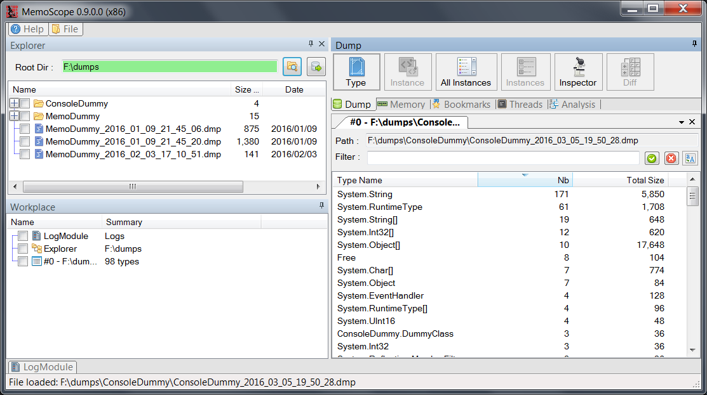
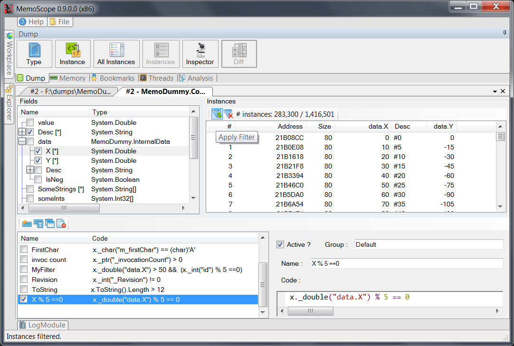
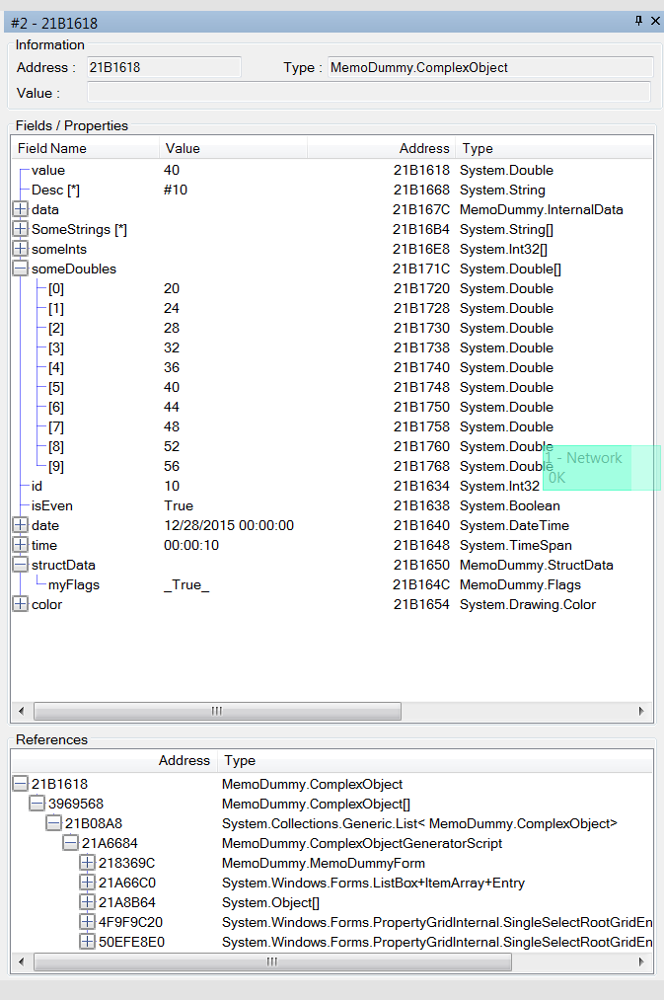
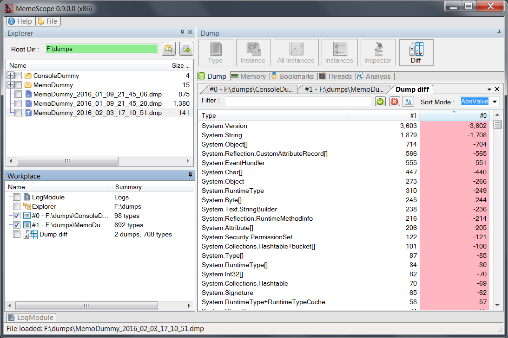
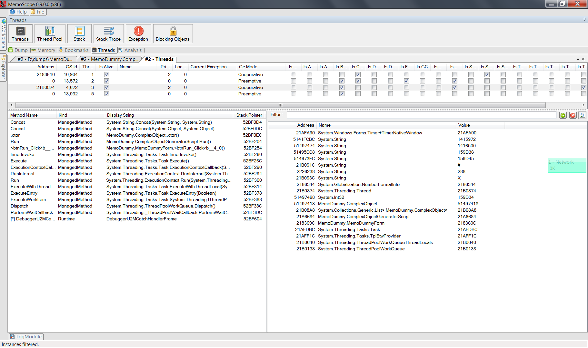
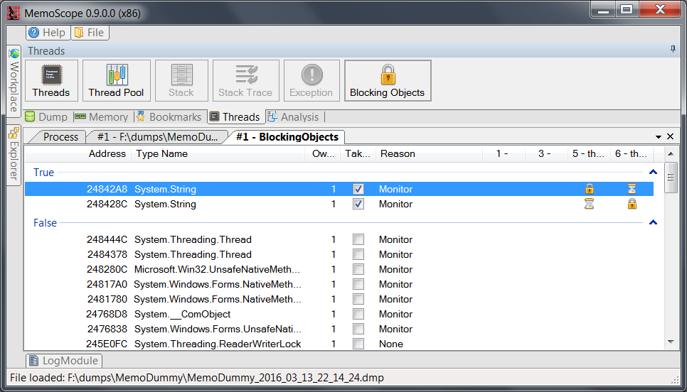
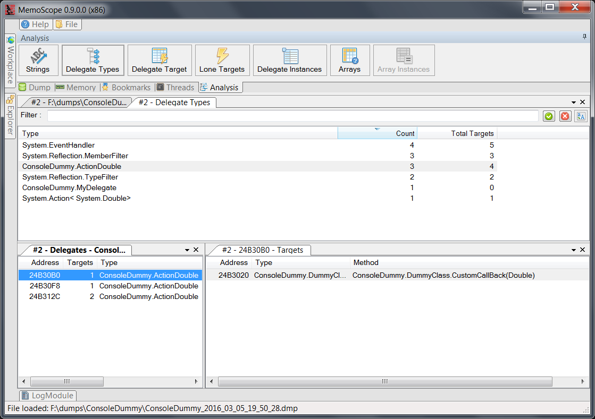
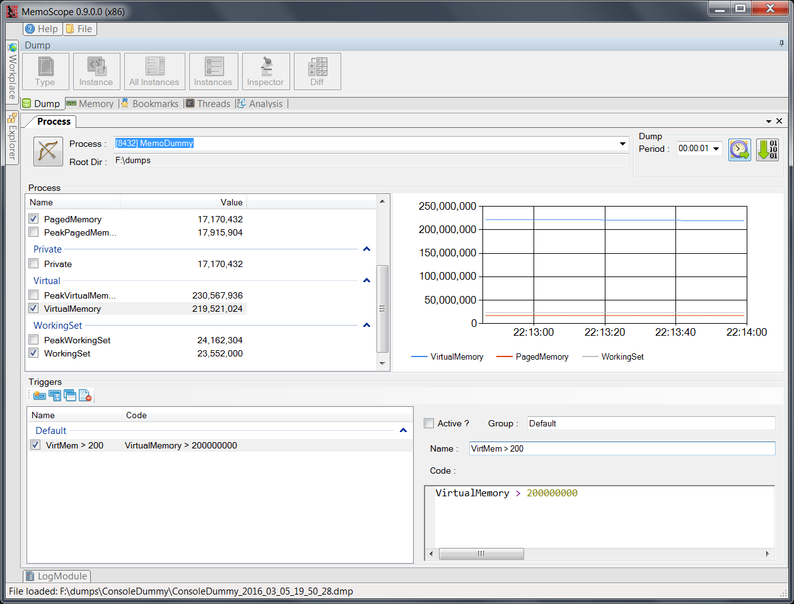

# MemoScope.Net

 | Dump and analyze .Net applications memory
---------------------|----------------------

# Features
 
## Heap statistics


## Query instances


## Instances content and references


## Compare dumps


## Threads, Stacks


## Deadlocks


## Delegates


## Dump process memory


## Memoscope API
Request a dump in your application code:
```C#
var client = new MemoScopeClient();
client.Open();
client.DumpMe(Process.GetCurrentProcess().Id);
```

# Thanks to...

* [Lee Culver](https://github.com/leculver) for his [ClrMd](https://github.com/Microsoft/clrmd) library, without it, MemoScope.Net would not exist.
* FatCow for their free [icons](http://www.fatcow.com/free-icons)
* Phillip Piper for [ObjectListView](http://objectlistview.sourceforge.net/cs/index.html). With it, it's so easy  to display tables and trees.
* [DockPanelSuite](http://dockpanelsuite.com/) contributors for their docking library
* Rupert Avery for [C# Expression Evaluator](https://csharpeval.codeplex.com/)
* [Jeff Cyr](https://github.com/JeffCyr) for [ClrMd.Extensions](https://github.com/JeffCyr/ClrMD.Extensions), even if I don't use it, I learnt a lot reading the source code (and I copy/pasted the ClrObject class !)
* [Jacob Slusser](https://github.com/jacobslusser) for its [ScintillaNet](https://github.com/jacobslusser/ScintillaNET) conmponent 
* Alois Kraus for his [article](http://geekswithblogs.net/akraus1/archive/2012/05/20/149699.aspx) about delegate internals
